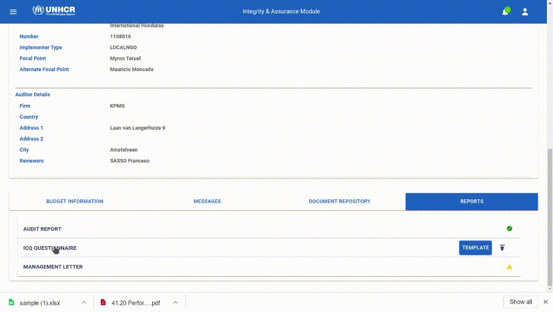
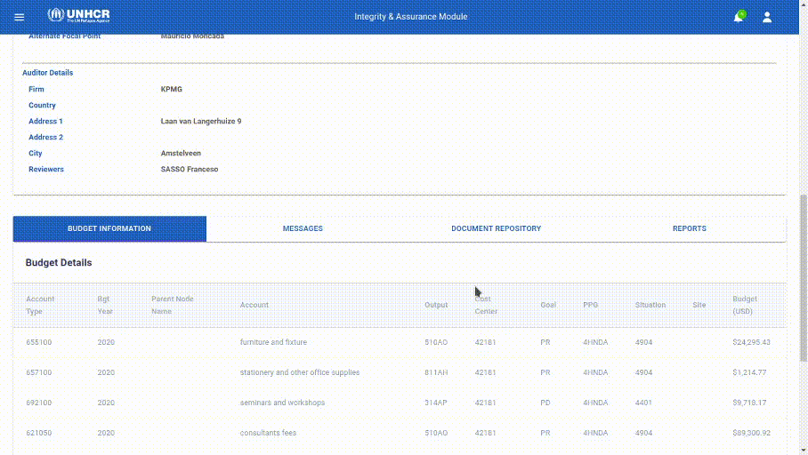

# Audit Process

Auditor Reviewer act as “focal point” of each Partnership Agreement assigned to the Audit Firm, and his role is to provide Audit Processes for a specific Agreement (or more than one in some exceptional cases).

## Viewing Project Agreements
When notified, Auditor Reviewer must perform following actions:

  1. [Log in into the system](getting-started.md)
  2. On the left menu, select Audit
  3. Auditor Reviewers will have visibility restricted to Project(s) Agreement assigned to their responsibility

## Project Audit Workspace

Each project has a seperate Workspace that can be accessed only by those who are meant to work on this particular project.

Those Workspaces provoide a collaborative environments for stakeholders to exchange information and audit deliverables.

To view details of each Project, a user can click on the Project Agreement listed in his Audit section.

A project workspace is divided into 3 main sections:

  1. Messages
  2. Document Repository
  3. Reports

### Messages
Messages allow users to post public messages to Project Agreement assigned focal points (UNHCR Field Office focal point, Partner focal point, Auditor Reviewers)

### Document Repository
Document Repository available for each Project Agreement to store all documents requested by Auditor and created during Audit process.

### Reports

Reports section is area dedicated and restricted to Auditor access only, where to create drafts of Audit Report, Management Letter and ICQ documentation.

other stakeholders can access this area after auditors finish their work and publish their reports.

## Audit Report

Auditor Report is a document that is already on the system as a form and need to be completed by Auditor Reviewer for each Project Agreement.

The yellow icon indicates that the Audit Report is not published and still in draft, not visible to any other focal point of the Project Agreement.

### Editing the Audit report

To edit the Audit Report, click in the Audit Report option from the reports section, and the document will open, then click on the edit button.

Complete the pertaining areas to complete the document and select Save

### Publishing the Audit Report

When ready, and not more changes need to be done on the Auditor Report, document can be published and shared with Project Agreement Focal point by selecting “Publish” button.

A warning will also appear to ask confirmation for the report to be visible to other project focal point

Click on Confirm, the status of the Report will be changed to Published

## ICQ Questionere
ICQ Questionere is a document that is submited by uploading a template to the system and is needed to be completed by the Auditor Reviewer and partners.

### Uploading An ICQ
A Reviewer can download the ICQ template by clicking on the "Template" button in the Reports section of a project.

After filling the ICQ, a Reviewer can upload the ICQ by clicking on the up arrow icon next to the Template button in the Reports section of a project.

An upload modal will be displayed asking to enter the file path that needs to be uploaded, it also asks the Reviewer to select the Partnership agreements that this ICQ will be uploaded for, as projects can share the same ICQ if they have the same Partner.

After selecting the file and the PAs, Reviewer can click on the submit button, after the system completes the upload process the ICQ will be availble for dowbload via the down arrow icon next to the Upload icon.

## Management Letter

After the Reviewer uploads the ICQ, the Management letter's initial data is populated from the ICQ, and is available to the Auditors to edit.

To access the Management letter just click on the Management letter option from the Reports section.

### Section 1

Section 1 is filled by auditors and it contains the follwong Fields:

1. Introduction
1. Scope of Work
3. Audit objectives
4. Executive Summary

### Section 2

Section 2 contains financial findings, it's filled by auditors, and after the management letter is published, partners and field offices can enter their input.

To Edit this section, you first have to select the finding you want to add your input to, then clicking on the arrow icon on the left of the finding will expand it to display it's details.

Clicking on the Pencil icon will display a modal with fields relevant to your role.

### Section 3

Section 3 contains findings related to the management control and compliance with the terms of agreement, it's populated from the ICQ, and after the management letter is published, partners and field offices can enter their input.

To Edit this section, you first have to select the ICQ key you want to add your input to, then clicking on the arrow icon on the left of the finding will expand it to display it's details.

Clicking on the Pencil icon will display a modal with fields relevant to your role.

### Section 4

Section 4 contains Overall assessment of partner's financial management capacity findings.

### Section 5

Section 5 contains Follow up of the implementation of previous audit recommendations.

Clicking on the Add button will open a form the auditor can fill and submit so when the management letter is published partners can view it.

### Publishing the Management letter

When the Reviewer completes the Management letter he can publish it by clicking on the publish button on the upper right corner of the page.

