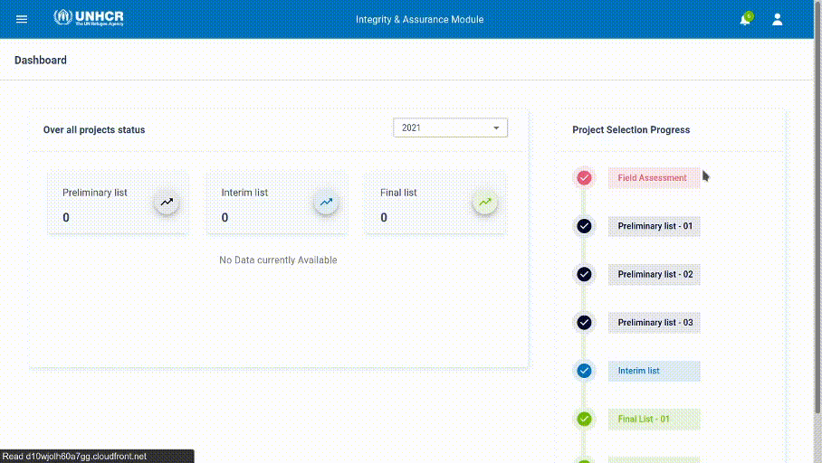
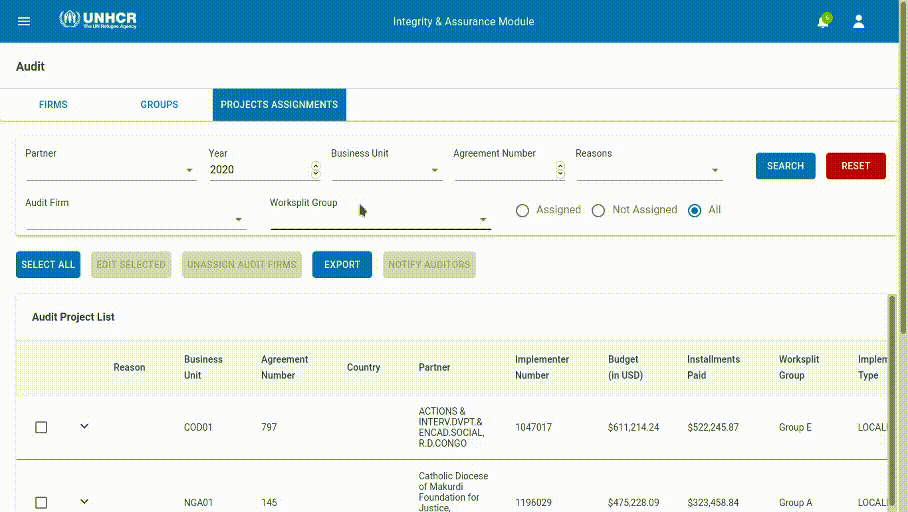

# Auditor Selection

Auditor Selection is the section where UNHCR HQ users will perform needed actions to Assign the final list of project agreements to be audited. The output of the Auditor Selection workflow is project agreements being assigned to audit firms.

The workflow starts when HQ users Finalize the [Project Selection Phase](project-selection.md).

Then a Business units are distributed across Worksplit groups so they can be assigned to audit firms.

Once an aduit firm is assigned to a project, they can move to the [Audit workflow](audit.md) and start auditing the projects they were assigned.

##Worksplit Groups

HQ Users can distribute Business units so it easier to assign business units with few projects to their audit firm by referring to their worksplit group.

##Assigning Projects to Audit Firm

HQ Users can filter list of project agreements and assigne audit firms to projets by selecting one or more projects and then clicking on edit select, then entering the name of the audit firm from the list.

##Assigning Projects to a Reviewer

After an Audit firm is assigned a project, the auditor admin should assign the project to one or more reviewers so they can start auditing it.

