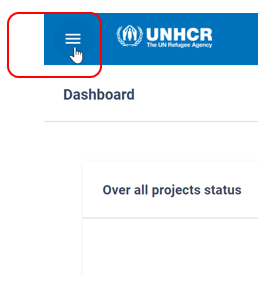
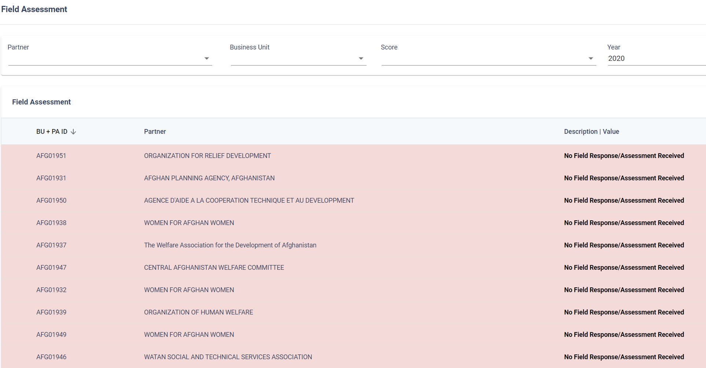
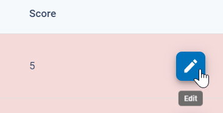
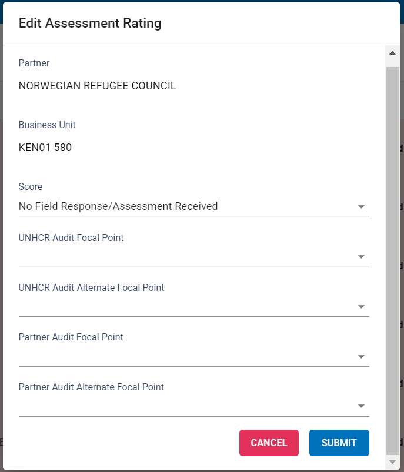
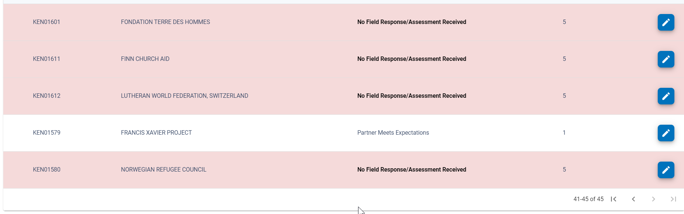
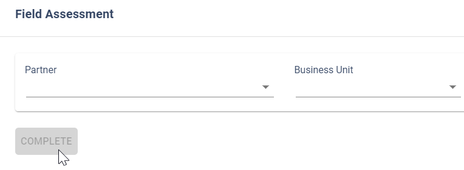
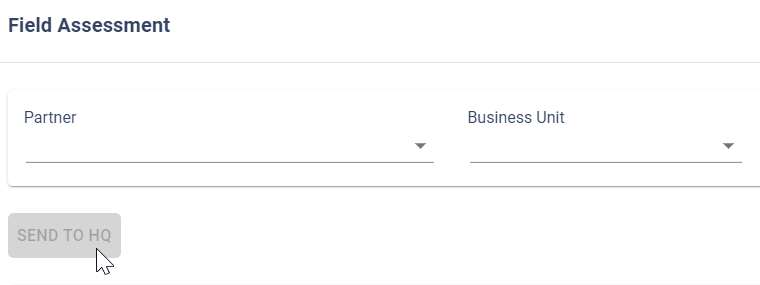

# Field Assessment

Field Assessment is the section where HQ Admins and Field Office users are able to view / edit the score for the value BU+Partner.

Field Assessment area is available on the system to HQ Admin users. In this HQ Admin they will have the visibility of Field Assessment overall status, with a dashboard listing all Business Units pending action with possibility (buttons) to send notification reminders.

Field Assessment for Field Office Users section will list only the values BU+Partner of the Business Unit listed on the User Profile. Field Office users will be able to amend the score of each listed entry BU+Partner and to submit the change on the system.

## Field Assessment Review

Open the menu here:

System will retrieve all the Partnership Agreements for the Audit Cycle in progress.

For adding field assessment for one project, click on the edit button on the given line:

.

The modal opens for adding all the required details for one project:

  - Add the score for the project
  - Add the UNHCR Audit Focal Point
  - Add the UNHCR Audit Alternate Focal Point
  - Add the Partner Focal Point
  - Add the Partner Alternate Focal Point (optional)

Note:.

- *UNHCR Audit Focal Point:
Field office user entitled to act as Auditor focal point if the project is selected for Audit process.*

- *UNHCR Audit Alternate Focal Point:
Field office user entitled to act as Auditor focal point alternate if the project is selected for Audit process.*

- *Partner Focal Point:
Partner user entitled to act as focal point for Auditors if the project is selected for Audit process.*

- *Partner Alternate Focal Point (optional)
Partner user entitled to act as focal point alternate for Auditors if the project is selected for Audit process.*

To confirm the assessment select Submit

Once the assessment is added successfully, the given line with the project becomes white:

Once all the projects are assessed, (that is, all lines are white) the reviewer can submit the list of assessed projects to the approver with clicking on the button ‘COMPLETE’. The button will be enabled only once all assessments are done at reviewer level:

## Field assessments Approval

Once the field assessment is conducted by the reviewer(s), approvers will receive an e-mail system notification, informing the Review of the Project Agreements pertaining to the specific business unit has been completed.

Approvers, once logged into the system, can navigate to Field Assessments menu.

Approvers can check the added scores and other values to each project and can align and modify the assessment.

Once the approver cross-checked the list of assessments and is confident with the added values and correctness, the approver can finalize the assessment with sending the assessment to HQ:

