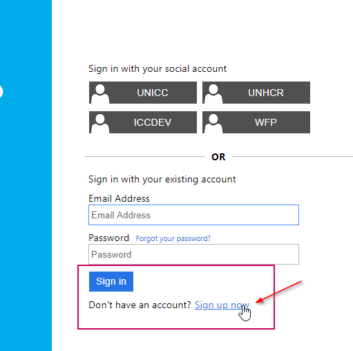
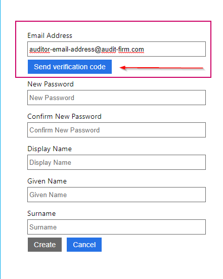
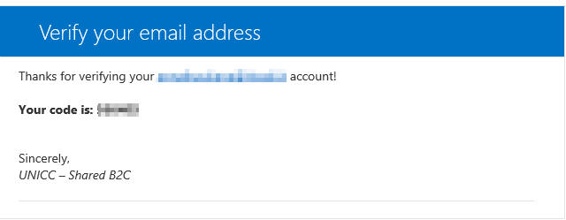
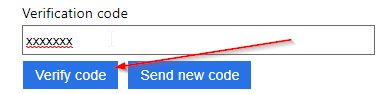
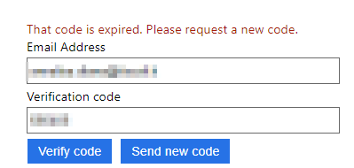
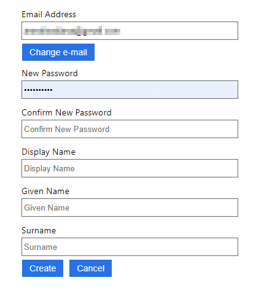
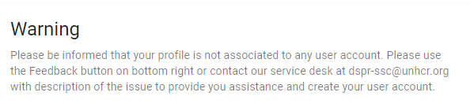

# Getting Started

To start using the Integrity and Assurance module you should recieve an invitation via email from the admin, following the link in the email will navigate you to the landing page of the system.

##Sign Up
After Following the link in the invitation email, click on Sign in

Click on the Sign Up now link

Add your email credentials and select “Send verification code”

Another email notification will be sent to the Email address containing the Verification Code

Copy and paste the code on the window and select Verify Code

If code has expired, request a new one.

click on “Send new code” button

Add again the new code:

The system allows now to add credentials and to change the login email to use (Note: the email register in this step will be needed to access the Audit Module with the given role)

When completed, click on “Create” button and the system will allow you access immediately on the Audit Module.

##Sign In

When registration is completed, to login to Audit Module use the below area:

## Sign in Error
Users logging to the Integrity and Assurance module with no associated role will read the below warning.

