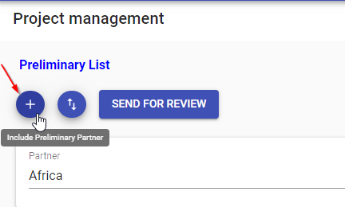

# Project Selection
Project Selection is the section where UNHCR HQ users will perform needed actions to create the final list of project agreements to be audited. The output of the Project Selection workflow is a final list of project agreements to be audited. The workflow starts with a request sent by HQ users to Business Unit to proceed with Field Assessment activity. Then a Preliminary List is identified by applying risk thresholds values that HQ apply to the preliminary list filter. Once the Preliminary List is finalized, the workflow move to a phase called Interim List where and then into a final phase called Final List.

The output of the Project Selection workflow, Final List of selected projects agreements, will be the starting point of the Audit Selection module/workflow.

The Project Selection section include the following menu/subsection:

## Preliminary List
The Preliminary List page contains all project agreements for a specific Year intended to be audited.
The content of the Preliminary List (Project Agreements finalized for a specific year) is modified by the HQ Preparer by changing the risk thresholds (settings) and/or applying a Sense Check (adding/removing manually PAs from the Preliminary List), upon request of HQ Reviewer and HQ Approver.

Preliminary List workflow includes 3 states:

- Under Preparation
- Under Review
- Under Approval

### Under preparation stage
Initially the PL contains only the project agreements with overall risk rating above the given  risk threshold. At this stage HQ Preparer can

  - modify risk threshold (Setting button **)
  - Add or Remove projects
  - Send the list to Under Review state.

** Moreover HQ Preparer can modify the settings concurring on the computation of the overall risk ratings (of each project) as well as the risk threshold to be applied and the Field Assessment values.

**Features available:**

- **Modification of Risk Tresholds and Field Assesment values**
- **Filtering Preliminary List**

PL can be filtered by:

    1. Partner
    2. Project Selection Year
    3. Reason PA Included/Excluded

- **Exporting File**
Additionally, the Preliminary List can be exported as “.csv” file.

- **Adding/Removing Project Agreements**
Preliminary List can be modified by adding/removing Project Agreements

When adding Project Agreements, the system allow to:

  - Search by Partner
  - Select a PA from a list (which is the list of Excluded PA)
  - Add a comment that is compulsory to complete the Add PA action

When removing PA:

  - system requires compulsory comments on Reason PA Excluded
  - Deleted PA will then appear in red on the Preliminary List (still in Under preparation)

- **Send Preliminary List to Review**
When the HQ preparer complete the list, it will send the list to the next stage by clicking the **“Send for Review”**

- **Receive notification from HQ Reviewer or HQ Approver**

When additional changes are needed to the Preliminary List when Under Review or Under Approval, the HQ Preparer is notified by email to proceed with further changes on the Preliminary List.

When ‘Send for Review’ button is selected, the Preliminary List status will change in Under Review.

**Notification:**

When the HQ Preparer  send the PL to review, en email will notify all HQ Reviewer(s) that a Preliminary List has been sent to Under Review Stage and and is pending action by HQ Reviewer.

### Under Review stage
In this section the preliminary List contains the project agreements selected during Under Preparation stage. On this stage only HQ Reviewers can view the Preliminary List.

**Features available on this stage:**

- **Testing variation of Risk Tresholds and Field Assesment values**
HQ Approver are able to view the Preliminary List that has been prepared and sent to approval by HQ Reviewer. Moreover HQ Approver can modify the settings concurring on the computation of the overall risk ratings (of each project) as well as the risk threshold to be applied and Field Assessment value.*The changes refleted on the Preliminary List after changing Settings values are not saved on the Preliminary List.*

- **Filtering Preliminary List**

PL can be filtered by:

  1. Partner
  2. Project Selection Year
  3. Reason PA Included/Excluded

- **Exporting File**
Preliminary List can be exported as “.csv” . The exported list will be the lastest Preliminary List confirmed by the HQ Preparer

- **Notify HQ Preparer of additional changes on Preliminary List**
If some changes need to be done on the list, HQ Reviewer can request additional action with a notification containing the list of actions requested by HQ Preparer

- **Receive notification from HQ Preparer**
When HQ Preparer send the Preliminary List to the Under Review stage, the HQ Reviewer is notified by email informing that Preliminary List is ready for Review

- **Send Preliminary List to Review**
When the HQ Reviewer complete the review of the Preliminary List will send the list to the next stage by clicking the **“Send for Approval”** button.

When Send for Approval is selected, the state of the PL will change in Under Approval.

**Notification**:
When the HQ Reviewer  send the PL to Approval Stage, en email will notify all HQ Approver that a Preliminary List has been sent to Under Approval Stage and and is pending action by HQ Approver.

### Under Approval stage

**Features available on this stage:**

- **Testing variation of Risk Tresholds and Field Assesment values**
HQ Approver are able to view the Preliminary List that has been prepared and sent to approval by HQ Reviewer. Moreover HQ Approver can modify the settings concurring on the computation of the overall risk ratings (of each project) as well as the risk threshold to be applied and Field Assessment value. *The changes refleted on the Preliminary List after changing Settings values are not saved on the Preliminary List.*

- **Filtering Preliminary List**

PL can be filtered by:

  1. Partner
  2. Project Selection Year
  3. Reason PA Included/Excluded

- **Exporting File**
Preliminary List can be exported as “.csv” . The exported list will be the lastest Preliminary List confirmed by the HQ Preparer

- **Notify HQ Preparer of additional changes on Preliminary List**
If some changes need to be done on the list, HQ Approver can request additional action with a notification containing the list of actions requested by HQ Preparer

- **Receive notification from HQ Reviewr**
When HQ Reviewer send the Preliminary List to the Under Approval stage, the HQ Approver is notified by email informing that Preliminary List is ready for Approval

- **Finalize Preliminary List**
When the HQ Approver complete the review of the Preliminary List will finalize the Preliminary List by clicking the “Finalize” button.

When Finalize button is selected, the Preliminary List workflow is completed and a new workflow “Interim List” is itiated by the system.  

**Notification:**

When the HQ Reviewr send the PL to approval, en email will notify all HQ Approver that a PL is ready for approval.

## Interim List

The Interim List page contains all project agreements that made it to the finalized Preliminary list.

The content of the Interim List (Project Agreements finalized for a specific year) is modified by the Field Officers by adding or removing project aggreements

Interim List workflow includes 2 states:

- Under Review
- Under Approval

### Under Review

In this section the Interim List contains the project agreements selected during the preliminary phase. On this stage Field Office Reviewers can view the projects of their Business unit in the inerim List.

**Features available on this stage:**

- **Filtering Interim List**

PL can be filtered by:

    1. Partner
    2. Project Selection Year

- **manually include\exclued Projects from the list**
Field officer can include or exclude projects from his Business unit list
- **Send Interim List to Review**
When the Field officer complete the review of the Interim List will send the list to the next stage by clicking the **“Send for Approval”** button.

When Send for Approval is selected, the state of the Interim list will change in Under Approval.

- **Remind Field Offices to fininsh their review**
HQ user who is monitoring the Interim list can click on remind button to remind all or some field Offices to finish their review.

**Notification**
Notification is sent when the Field Office Reviewer of a business unit complete the
Interim assessment as Field Office reviewer and send to approval to Field Office Approver the Interim selection of PPA.

### Under Approval

**Features available on this stage:**

- **Filtering Interim List**

PL can be filtered by:

  1. Partner
  2. Project Selection Year

- **Approve/Decline the new list of Projects**
Field Office Approver will review the list and he can approve it, or reject it with notes to the reviewer on what's needs to be adjusted.

- **End the Interim phase**
HQ user who is monitoring the Interim list can end the Interim phase after all field Offices approve their lists, initiating the begining of the Final phase.

## Final List
The Final List page contains all project agreements that made it to the finalized Preliminary list.

The content of the Final List (Project Agreements finalized for a specific year) is modified by the HQ Users by adding or removing project aggreements

Final List workflow includes 2 states:

- Under Review
- Under Approval

### Under Review

In this section the Final List contains the project agreements selected during the Interim phase.

**Features available on this stage:**

- **Filtering Final List**

Final List can be filtered by:

    1. Partner
    2. Project Selection Year
    3. Reason PA Included/Excluded

- **manually include\exclued Projects from the list**
Field officer can include or exclude projects from his Business unit list
- **Send Final List to Review**
When the HQ reviewer completes the review of the Final List. He will send the list to the next stage by clicking the **“Send for Approval”** button.

When Send for Approval is selected, the state of the Final list will change in Under Approval.

### Under Approval

**Features available on this stage:**

- **Filtering Final List**

Final list can be filtered by:

  1. Partner
  2. Project Selection Year

- **Approve/Decline the new list of Projects**
HQ Approver will review the list and he can approve it, or reject it with notes to the reviewer on what's needs to be adjusted.

- **End the Final phase**
 HQ approver can trigger the finalization of the final list to be sent to auditor.

 The "Finalize" button triggers the END of Project Selection workflow and the START of the [Auditor Assignment](auditor-selection.md) workflow.
